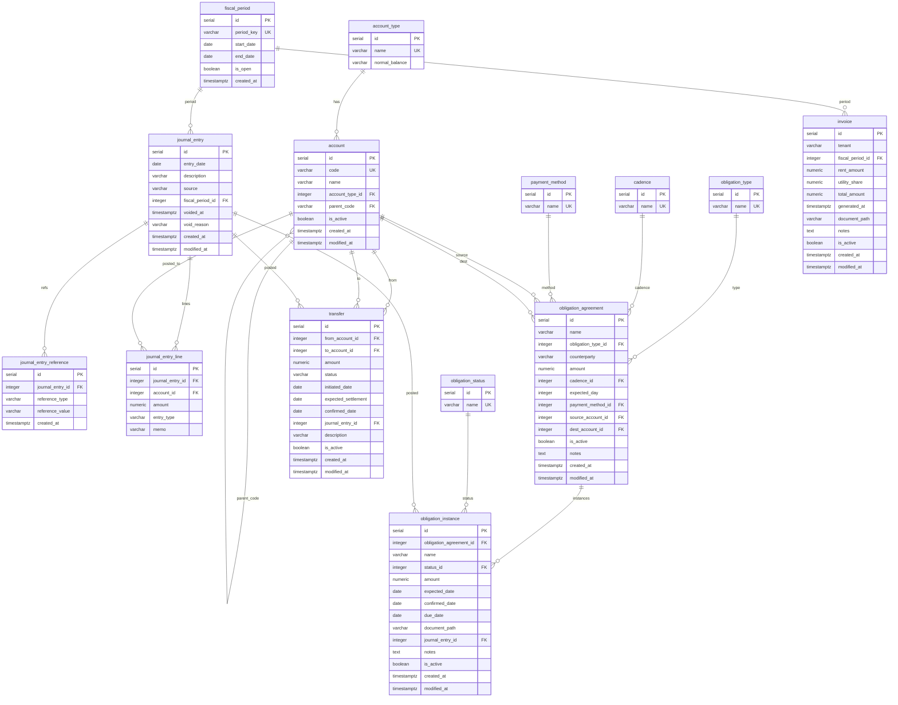

# Project 1 — Database Schema, Migrations, and Seed Data

## Overview

Stand up the Leo Bloom database layer: two PostgreSQL schemas (`ledger`, `ops`),
16 tables, seed data for all lookup tables + a sample chart of accounts, and
Gherkin acceptance specs for structural constraints. Delivered as an F# console
app (`LeoBloom.Migrations`) that runs numbered SQL migration files against either
`leobloom_dev` or `leobloom_prod`.

No application code. No business logic. Structural integrity only.

## Problem Statement / Motivation

Leo Bloom has no database yet. Everything downstream — domain types, API, UI —
depends on a stable, correctly constrained schema. This project establishes the
foundation and proves the migration tooling before any application code is written.

## Proposed Solution

### Phase 1: Environment Setup
- Upgrade all `.fsproj` targets from `net8.0` to `net10.0`
- Verify .NET 10 SDK is installed in the sandbox (install if not)
- Verify PostgreSQL connectivity to `leobloom_dev` (172.18.0.1:5432, role `claude`)
- Wire up `appsettings.Development.json` with connection string (password via env var)

### Phase 2: Migration Infrastructure
- Add migration tool NuGet package to `LeoBloom.Migrations`
- Implement `Program.fs` — read config, resolve connection string, run migrations
- Establish SQL migration file naming convention (depends on tool choice)
- Verify the migration journal table is created on first run

### Phase 3: Ledger Schema Migrations
SQL migration files executed in this order:
1. Create `ledger` schema
2. `ledger.account_type` — lookup table (5 rows)
3. `ledger.account` — chart of accounts with self-ref FK on `code`
4. `ledger.fiscal_period` — monthly periods
5. `ledger.journal_entry` — transaction headers
6. `ledger.journal_entry_reference` — external reference numbers
7. `ledger.journal_entry_line` — debit/credit postings

### Phase 4: Ledger Seed Data
Interleaved after table creation (FK dependencies require this ordering):
1. Seed `ledger.account_type` — 5 rows (asset, liability, equity, revenue, expense)
2. Seed `ledger.fiscal_period` — 36 months (2026-01 through 2028-12)
3. Seed `ledger.account` — sample COA from `Specs/SampleCOA.md` (~60 accounts)

COA must be inserted in parent-first order due to `parent_code` FK.

### Phase 5: Ops Schema Migrations
1. Create `ops` schema
2. `ops.obligation_type` — lookup (2 rows)
3. `ops.obligation_status` — lookup (6 rows)
4. `ops.cadence` — lookup (4 rows)
5. `ops.payment_method` — lookup (6 rows)
6. `ops.obligation_agreement` — FKs to ops lookups + ledger.account
7. `ops.obligation_instance` — FKs to agreement, status, journal_entry
8. `ops.transfer` — FKs to ledger.account, journal_entry
9. `ops.invoice` — FK to ledger.fiscal_period, UNIQUE(tenant, fiscal_period_id)

### Phase 6: Ops Seed Data
Seed lookup tables immediately after their creation migrations:
- obligation_type, obligation_status, cadence, payment_method

### Phase 7: Gherkin Acceptance Specs
Write structural constraint scenarios to `Specs/Acceptance/`. These are
specification documents for Project 1; the executable test harness comes in
Project 2.

## Technical Considerations

### Migration Tool — DECIDED: Migrondi

**Migrondi v1.2.0** — F#-native (95.8% F#), actively maintained by Angel Munoz.
Flyway-style: numbered SQL files, run in order, journal table tracks execution.
Automatic transactional migrations. Available as NuGet package or dotnet CLI tool.

Chosen because:
- F# all the way down — this is the only F#-native migration runner
- SQL files are portable — if Migrondi ever dies, switching runners is trivial
- Zero lock-in risk: the journal table is the only coupling, one-time migration to switch
- Low supply chain risk in the .NET ecosystem

Alternatives considered and rejected:
- **DbUp**: Battle-tested but C#-flavored API. Would work fine, but Migrondi
  better fits the project philosophy. DbUp remains the fallback if needed.
- **Evolve**: Dead. Last release Jun 2023.
- **FluentMigrator**: Code-first, opposite of what we want.

### Architecture
- One-way schema dependency: `ops` → `ledger`. Ledger is self-contained
- All FKs are structural enforcement. All business rules live in app layer (Project 2)
- Surrogate `id` PKs everywhere. `account.code` is business identifier, `id` is for FKs
- Self-referential FK: `account.parent_code` → `account.code` (not `id`)

### Performance Implications
- Key queries (trial balance, account balance, P&L by subtree) imply indexes on:
  - `journal_entry_line(journal_entry_id)`, `journal_entry_line(account_id)`
  - `journal_entry(fiscal_period_id)`, `journal_entry(voided_at)` (partial index on non-void)
  - `obligation_instance(status_id, expected_date)`
- Index strategy can be deferred to a later migration but should be planned now

## Spec Gaps — Resolved

1. **`(obligation_agreement_id, expected_date)` uniqueness**: App-layer only. Not a
   DB constraint. Business logic — future billing arrangements might legitimately
   have multiple instances per date.

2. **ON DELETE RESTRICT on all FKs**: Yes. Append-only ledger + soft deletes on all
   tables = RESTRICT everywhere is correct.

3. **CHECK constraints**: No. 3NF with FK constraints to lookup tables covers the
   same ground. No CHECK constraints in scope.

4. **COA type mismatches**: Hobson split the accounts. Resolved upstream.

5. **`obligation_instance.expected_date` NOT NULL**: Hobson updated the data model
   spec and added a Gherkin scenario. Resolved upstream.

6. **`fiscal_period` end_date test**: Still needs a separate Gherkin scenario for
   null `end_date`. Will address when writing acceptance specs.

### NICE-TO-HAVE — Improves completeness

7. **Missing NOT NULL tests**: `is_active` columns (account, obligation_instance,
   transfer, invoice), `is_open` (fiscal_period), all `created_at`/`modified_at`
   columns — none tested.

8. **Missing DEFAULT value tests**: `is_active DEFAULT true`, `is_open DEFAULT true`,
   `status DEFAULT 'initiated'`, `created_at/modified_at DEFAULT now()` — none verified.

9. **`account.parent_code` self-ref FK tension**: The spec says surrogate `id` exists
   so "FK references don't break if codes renumber" — but `parent_code` IS an FK on
   `code`, and it WILL break on renumber. Design tension worth acknowledging even if
   we don't fix it now.

10. **`fiscal_period` CHECK constraint**: `start_date < end_date` is cheap insurance
    against nonsense data.

## Acceptance Criteria

- [x] All `.fsproj` files target `net10.0`
- [x] `LeoBloom.Migrations` runs against `leobloom_dev` and creates the migration journal
- [x] `ledger` schema exists with 7 tables, all FKs enforced
- [x] `ops` schema exists with 9 tables, all FKs enforced (including cross-schema to `ledger`)
- [x] All lookup tables seeded with correct data
- [x] 36 fiscal periods seeded (2026-01 through 2028-12)
- [x] Sample COA loaded with parent-child hierarchy intact (69 accounts)
- [x] `UNIQUE(tenant, fiscal_period_id)` enforced on `invoice`
- [x] Gherkin acceptance specs written covering all structural constraints
- [x] Migrations are idempotent (safe to re-run — journal prevents re-execution)
- [x] `appsettings.Development.json` configured, password via env var
- [x] Running `LeoBloom.Migrations` a second time produces no errors and no changes

## Success Metrics

- Zero structural constraint violations possible at the database level (for in-scope constraints)
- Migrations execute cleanly on an empty database in < 5 seconds
- Both `ledger` and `ops` schemas queryable with correct FK relationships

## Dependencies & Risks

| Dependency | Status | Owner |
|---|---|---|
| `leobloom_dev` database created | Done | Dan |
| PostgreSQL role `claude` with permissions | Done | Dan |
| Migration tool decision | **Migrondi v1.2.0** | Dan + BD |
| .NET 10 SDK in sandbox | Needs verification | BD |
| Prod COA SQL inserts | Out of scope | Hobson |

**Risks:**
- Migrondi's small community could mean less help when things get weird
- The COA type mismatches (7020, 9010) will create downstream problems in P&L queries
  if not resolved now
- Self-referential FK on `account.code` makes future code renumbering painful

## ERD

## Sources & References

### Internal References
- Data model: `Specs/DataModelSpec.md`
- Project 1 BRD: `Projects/Project1-Database.md`
- Sample COA: `Specs/SampleCOA.md`
- BD orientation: `BdsNotes/wakeup-2026-04-02a.md`

### External References
- [DbUp GitHub](https://github.com/DbUp/DbUp) — v6.1.1+ core, v7.0.1 PostgreSQL provider
- [Migrondi GitHub](https://github.com/AngelMunoz/Migrondi) — v1.2.0, F#-native
- [dbup-postgresql NuGet](https://www.nuget.org/packages/dbup-postgresql)
- [Migrondi NuGet](https://www.nuget.org/packages/Migrondi)
